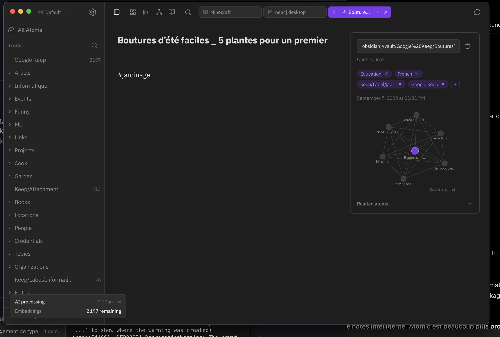
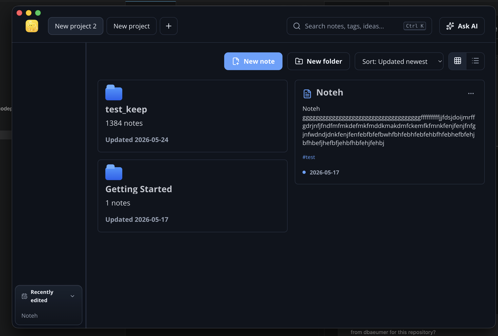
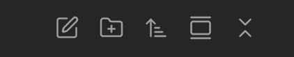
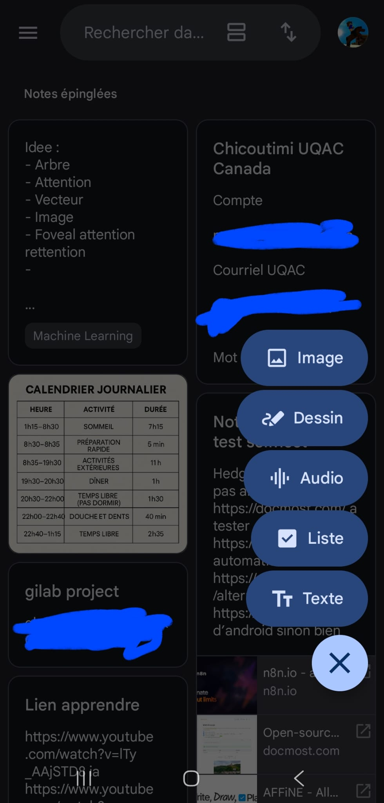
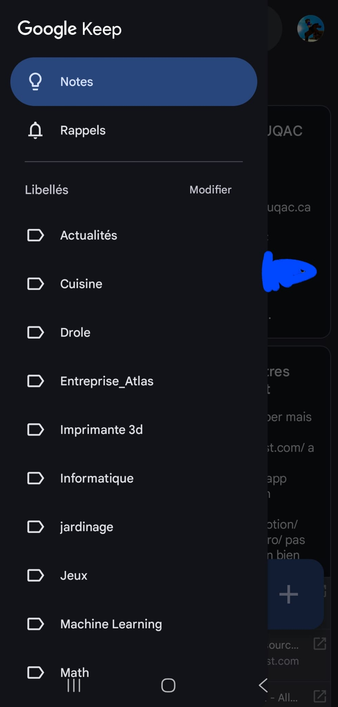
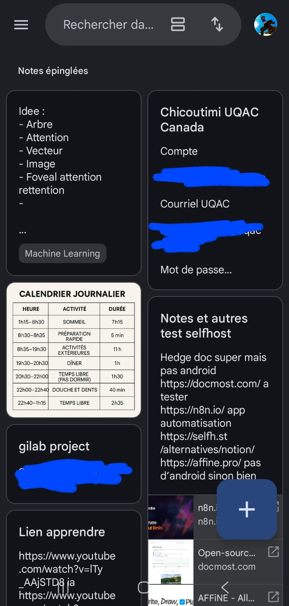
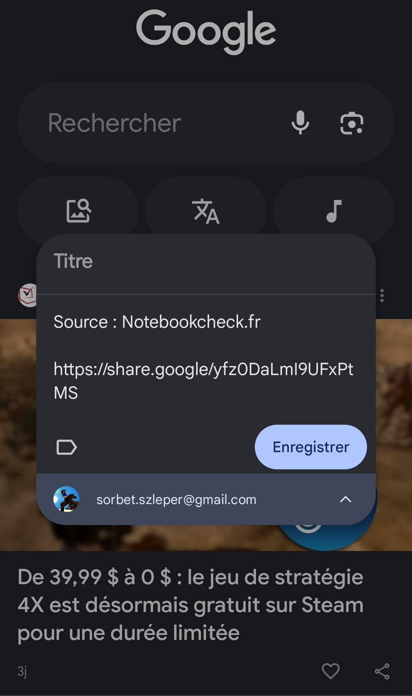
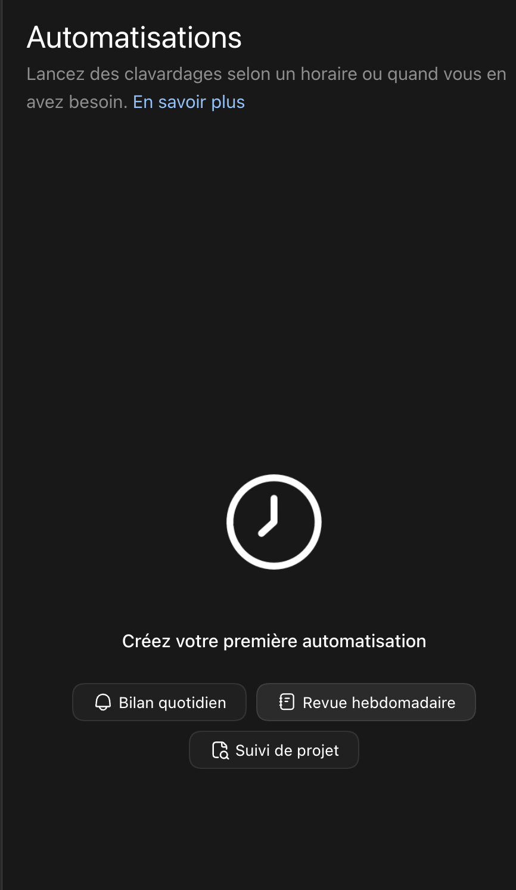

# Liste des modifications a faire
- Modification d'interface :

Le but est de modifier l'interface de notre app pour etre plus simple et moins encombrer.

L'endroit ou il y a ecrit default sera le volet pour switch entre les differentes vault, donc plus besoin de les afficher en grand et de prendre autant de place.
la barre de recherche n'a pas besoin d'etre si grande et un simple icon suffit.
J'aime bien l'icon mais on va mettre plus tot l'angranage pour les parametres et son emplacement dans la barre vertical retractable et mieux que notre systeme actuel.
Aussi All notes est mieux.
Pour le reste, je souhaite prendre le systeme d'obsidian et de atomic, on arrete d'afficher les dossiers dans le centre de l'app.
On va juste deplier les dossiers sur le coter (on vera donc tout les dossiers) (recupere la facon de faire de atomic)
Rajoute aussi dans les icons, un icons graph pour afficher le graph en grand 

- importations des notes google keep et autre. regarder projet https://github.com/SorbetUP/blinko-offline

- editer les images

- cree un site web a partir d'un dossier.

- garde recently edited mais adapte le.

- compare a atomic et autre, on va recupere la creation de note et de dossier de obsidian 
on va certe pour la recherche etc se baser sur le systeme atomic mais ce souvenir des tags pour la vie de tout les jours n'est pas pratique, donc on va cree des dossies, notes et mettre des pdf et autres documents.
Juste au dessus de all note on aurra l'interface pour cree des notes, cree des dossiers etc...
All note sera delimite de la vrai arborescence par un espace vide legerement plus grand.

- Rajouter a cette liste toute les modifications de fonctionnalites ajouter a marktext precedement, comme par exemple excalidraw.
- On va garder aussi l'editeur de notes de marktext (Muya) et sa surcouche que l'on a cree visuellement, il faudra juste adapter.

- Rajoute aussi le dashboard de atomics et la vue wiki.

- On va prendre le systeme complet qui fait de atomic la nouvelle base du projet, la partie recherche, structuration des informations.
Tu dois rajouter a cette liste l'ensemble des fonctionnalites composant cette pierre angulaire de atomic. le but est d'avoir l'auto tagging, agentic chat, mcp integration, wiki synthesis, spacial canvas, des sources integrer directement et automatiquement, la recher par meaning, les citations ..... tout .....

- Seulement compare a atomics, nous on va integrer une liste de model ou l'user pourra choisir celui qu'il veut. on aurra le model d'embedding, chat etc...
Le but est de tout avoir integrer dans l'app. on laisse toujours la possibilite de passer par ollama ou autre comme atomic mais en cas de flemme par defaut on propose une liste et l'user peux selectionner un model pour le download et l'utiliser directement dans l'app sans rien faire d'autre. Comme sur handy.

- on reprend les theme d'atomics.

- Mettre en place un sync a la syncthing en utilisant un historique de modifs compacte et performant en s'inspirant de git. https://github.com/syncthing/syncthing etant un projet sous une license n'autorisant pas l'utilisation permissive, je voudrais que tu n'utilise pas leur code.

Tu peux utiliser des briques et composants de n'importe qu'elle projet tant que celui si est sous une licence mit ou similaire. (utilisation commercial sans partage du code, pas de partage des modifs etc...)

- App android en t'inspirant de l'interface de google keep mais en l'adaptant a notre projet mais en restant minimaliste google keep. tu peux t'inpirer de projet de copie de google keep disponible sur internet.

- Dans l'app android, il faut absolument que les donnees soit stocker en offline aussi.

- La partie atomic (graph etc...) doit etre accessible sur mobile mais pas faire tourner de gros model lourd. (ou en tout cas pas pour le moment)

- Dans l'app mobile android, il faut que quand sur android on fasse partager vers, alors cela nous propose de partager vers notre apps de notes. que cela affiche au dessus de l'app et nous affiche la note etc... 

- rajouter des models text to speech (comme par exemple kitten, kokoro, supertonic etc..), reflechis a comme les integrer dans l'ui pour etre beau, moderne, simple et pratique.

- rajouter des models speach to text (comme par exemple parakeet v2, whisper turbo, whisper large etc..), reflechis a comme les integrer dans l'ui pour etre beau, moderne, simple et pratique.

- Si possible modifier mayu pour etre plus optimiser et aussi rajouter que l'on puisse dans les parametres declarer des environnements et executer des programmes dans ces env, directement depuis les notes, wiki, dashboard, etc....

- Rajouter dans les parametres une zone pour faire des taches programmatiques 
comme dans codex par exemple 

- rajoute bien sure que l'app puisse communiquer avec des agents/llm, api etc ...

- Rajoute un icon calendrier a cote des autres icons en haut et rajoute un vrai calendrier a la google calendar. fait aussi que dans la partie importations, 
on puisse important tout ce qu'il y a depuis notre google calendar (pour faire une transition).
Fait une zone plugins avec comme premiere plugin a cree :
on puisse liee son google calendar pour avoir une sync entre les 2 calendriers

- Il faut que les plugins soit bien definie et tout .... 